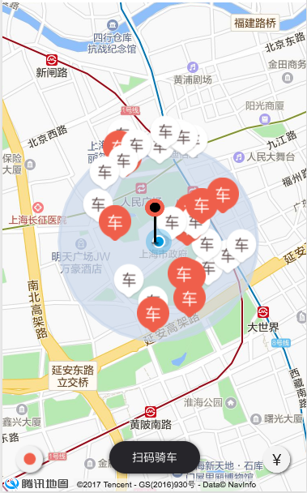

# 仿摩拜单车小程序

探索中，不一定是完全仿，可能会在这个demo中尝试一下其他的api或者技术之类的。

## 问题

1. 蓝色圆圈的半径的确定。我看摩拜官方的是不确定的，而我的感觉是应该包含附近所有的车辆(对应地图中的marker)。之所以不确定，是因为计算当前位置（中心点）到最远的那个marker的距离有些困难。而且还没确定蓝色圆圈的半径距离是map上像素的距离还是和座标点之间的距离有关。

2. 蓝色圆圈应该跟着当前位置移动，目前还没确定如何做。

